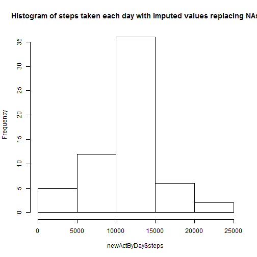

Reproducible Research Peer Assignment 1 by Saurabh Swarup
========================================================

**Loading and preprocessing the data**

Show any code that is needed to

Load the data (i.e. read.csv())

Process/transform the data (if necessary) into a format suitable for your analysis


```r
library(stats)
library(ggplot2)
library(dplyr)
```

```
## 
## Attaching package: 'dplyr'
## 
## The following objects are masked from 'package:stats':
## 
##     filter, lag
## 
## The following objects are masked from 'package:base':
## 
##     intersect, setdiff, setequal, union
```

```r
activity <- read.csv("activity.csv")
activity$date <- as.Date(activity$date, "%Y-%m-%d")
activity$interval <- factor(activity$interval)
```

**What is mean total number of steps taken per day?**

Make a histogram of the total number of steps taken each day


```r
actByDay <- aggregate(steps ~ date, data = activity, FUN = sum)
hist(actByDay$steps, main = "Histogram of steps taken each day")
```

 

Calculate and report the mean and median total number of steps taken per day


```r
meanStepsPerDay <- mean(actByDay$steps, na.rm = "TRUE")
medianStepsPerDay <- median(actByDay$steps, na.rm = "TRUE")
```

The mean steps per day is 1.0766 &times; 10<sup>4</sup> and median steps per day is 10765

**What is the average daily activity pattern?**

Make a time series plot (i.e. type = "l") of the 5-minute interval (x-axis) 
and the average number of steps taken, averaged across all days (y-axis)


```r
actByInterval <- aggregate(steps ~ interval, data = activity, FUN = mean)
qplot(interval, steps, data = actByInterval, xlab="5 Minute Interval", ylab="Average Steps")
```

 

Which 5-minute interval, on average across all the days in the dataset, 
contains the maximum number of steps?


```r
maxInterval <- which.max(actByInterval$steps)
maxIntervalSteps <- max(actByInterval$steps)
```

The 104 is the 5-minute interval with maximum steps of 206.1698

**Imputing missing values**

Calculate and report the total number of missing values in the dataset 
(i.e. the total number of rows with NAs)


```r
NARows <- length(is.na(activity$steps))
```

Devise a strategy for filling in all of the missing values in the dataset. 
The strategy does not need to be sophisticated. For example, you could use 
the mean/median for that day, or the mean for that 5-minute interval, etc.

*I choose to fill in with the average for the 5 minute interval*

```r
newActivity <- merge(activity, actByInterval, by = "interval", all.x=TRUE, suffixes = c(".x",".y"))

for (i in 1:nrow(newActivity)) {
        
        if(is.na(newActivity$steps.x[i])) {
                newActivity$steps[i] <- newActivity$steps.y[i]
        } else newActivity$steps[i] <- newActivity$steps.x[i]
}
```

Create a new dataset that is equal to the original dataset but with the 
missing data filled in.


```r
newActivity <- subset(newActivity, select = c("steps", "date", "interval"))
newActivity <- arrange(newActivity, date, interval)
```


Make a histogram of the total number of steps taken each day and Calculate 
and report the mean and median total number of steps taken per day. 
Do these values differ from the estimates from the first part of the 
assignment? What is the impact of imputing missing data on the estimates 
of the total daily number of steps?


```r
newActByDay <- aggregate(steps ~ date, data = newActivity, FUN = sum)
hist(newActByDay$steps, main = "Histogram of steps taken each day with imputed values replacing NAs")
```

 


```r
NewMeanStepsPerDay <- mean(newActByDay$steps, na.rm = "TRUE")
NewMedianStepsPerDay <- median(newActByDay$steps, na.rm = "TRUE")
```

The mean steps per day is 1.0766 &times; 10<sup>4</sup> and median steps per day is 1.0766 &times; 10<sup>4</sup>

**Are there differences in activity patterns between weekdays and weekends?**

Create a new factor variable in the dataset with two levels - 
"weekday" and "weekend" indicating whether a given date is a weekday 
or weekend day.


```r
newActivity$day <- weekdays(newActivity$date)

for (i in 1:nrow(newActivity)) {
        
        if(newActivity$day[i] == "Saturday" || newActivity$day[i] == "Sunday") {
                newActivity$dayType[i] <- "Weekend"
        } else newActivity$dayType[i] <- "Weekday"
}
```

Make a panel plot containing a time series plot (i.e. type = "l") of the 
5-minute interval (x-axis) and the average number of steps taken, 
averaged across all weekday days or weekend days (y-axis). 
The plot should look something like the following, which was creating 
using simulated data:


```r
newActByInterval <- aggregate(steps ~ interval + dayType, data = newActivity, FUN = mean)
qplot(interval, steps, data = newActByInterval, type = "l", xlab="5 Minute Interval", ylab="Average Steps", facets = dayType ~ .)
```

 
